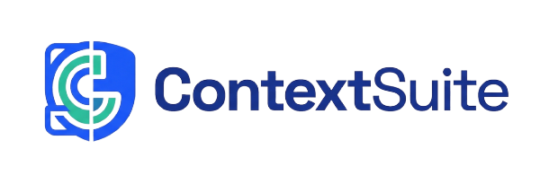

# ContextSuite

<p align="center">
  
</p>

<p align="center">
  <strong>Context, governance, and memory for AI coding workflows</strong>
</p>

<p align="center">
  <a href="#license"></a>
  <a href="#workflow"></a>
  <a href="#workflow"></a>
  <a href="#architecture-snapshot"></a>
</p>

ContextSuite is a context, governance, and memory layer for AI coding workflows.

Instead of sending prompts directly to a coding assistant, the user sends them to a Context Agent first. The Context Agent gathers project memory, checks constraints and prior incidents, reviews the plan, and only then hands execution to a coding assistant through a real A2A JSON-RPC bridge.

<p align="center">
  
  
  
  
</p>

<p align="center">
  
  
  
  
</p>

<p align="center">
  
</p>

## Workflow

When a user sends a prompt, the following steps happen automatically:

1. **Intake** — The Context Agent receives the prompt and classifies the request:
   - *New feature* — searches project documentation, prior art, and relevant code to assemble the best available context.
   - *Bug or fix* — researches related bugs, past issues, and how similar problems were previously solved.

2. **Key Findings** — The Context Agent compiles its findings—relevant code, constraints, past decisions, and known risks—into a structured context package.

3. **Plan Request** — The context package is sent to the Coder Agent via the configured coding assistant adapter (Codex, Claude Code, or Cursor CLI), which prepares a detailed execution plan and returns it.

4. **Review & Governance** — The Context Agent reviews the plan against project constraints, legacy rules, and risk level:
   - *Approved* — the plan is clean, constraints are met, nothing is at risk. Execution proceeds.
   - *Rejected or Delegated* — the Context Agent explains exactly why the plan fails and sends the feedback back to the Coder Agent, which must revise and resubmit.

5. **Execution** — Once the plan passes review, the Context Agent dispatches the approved task to the Coder Agent over A2A JSON-RPC. The Coder Agent executes the change in the local workspace and returns the result.

6. **Memory** — After every resolved fix or completed feature, the issue, solution, and key decisions are indexed into project memory (Supabase, Qdrant, Neo4j) so future requests benefit from what was learned.


## What Works Today

- Real A2A agent card discovery at `/.well-known/agent-card.json`
- Real A2A JSON-RPC endpoints at `/a2a/{assistant_id}` with `message/send` and `tasks/get`
- Context Agent workflow: intake → retrieve → plan → classify → approve → package → dispatch
- Context Agent → CLI Agent handoff over A2A JSON-RPC
- Adapter support for `codex`, `claude`, and `cursor`
- Context retrieval from Supabase, Qdrant Cloud, and Neo4j Aura
- Interactive terminal app via `contextsuite`
- Demo repository and scenarios for `acme/payments`

## A2A Compatibility

Implemented now:

- `/.well-known/agent-card.json` on both agents, plus the legacy `/.well-known/agent.json` alias
- `/a2a/contextsuite-context-agent` and `/a2a/contextsuite-cli-agent`
- JSON-RPC `message/send` on both agents
- JSON-RPC `tasks/get` on both agents
- Context Agent approval resume over A2A by sending a follow-up `message/send` with the task ID returned by the first call

Still partial:

- `message/stream` is not implemented yet
- Push notifications are not implemented
- Non-blocking/background A2A execution is not implemented yet
- CLI Agent `tasks/get` is in-memory for the current process, while Context Agent `tasks/get` is backed by persisted run data

## Why It Exists

AI coding tools are fast, but they often lose important project context over time. Teams repeat bugs, miss constraints, and forget why past decisions were made. ContextSuite keeps that memory available at the moment a change is requested.

## Architecture Snapshot

- Orchestration: LangGraph
- Agent-to-agent communication: A2A
- Local execution bridge: ContextSuite Local Agent Client
- Coding assistants for MVP: Codex CLI, Claude Code CLI, Cursor CLI
- Model and embeddings: Gemini + Gemini Embedding 2 multimodal
- Relational system of record: Supabase
- Vector retrieval: Qdrant Cloud
- Relationship graph: Neo4j Aura

## Project Structure

```
packages/
  shared/              Shared A2A contracts, agent cards, and types (Pydantic)
  context-agent/       Context Agent — LangGraph workflow, retrieval, persistence
  cli-agent/           CLI Agent — local client that runs coding assistant CLIs
  cli-app/             Interactive terminal client (`contextsuite`)
scripts/               Connectivity checks, seeding, and demo helpers
docs/
  architecture.md      Monorepo layout and package roles
  pipeline.md          Runtime and testing guide
  workflow.md          Workflow and API behavior
  user-guideline.md    End-to-end test instructions for humans
  plan.md              MVP execution checklist
```

See [`docs/architecture.md`](docs/architecture.md) for the complete folder tree.

## Prerequisites

- Python 3.12+
- [uv](https://docs.astral.sh/uv/) (package manager)
- Access to Supabase, Qdrant Cloud, Neo4j Aura, and Google Gemini
- At least one supported assistant CLI installed on `PATH`

Assistant CLI examples:

- Codex: `npm install -g @openai/codex`
- Claude Code: `npm install -g @anthropic-ai/claude-code`
- Cursor: make sure the `cursor` command is available on `PATH`

## Local Setup

Copy `.env.example` to `.env` and fill in your values before starting.

PowerShell:

```powershell
Copy-Item .env.example .env
```

Important Neo4j note:

- `NEO4J_URI` should use `neo4j+s://`
- `NEO4J_DATABASE` must be the Aura database ID, not always `neo4j`

```bash
# Clone and enter the repo
git clone <repo-url> && cd heilbronn-hackathon

# Copy env template and fill in your values
cp .env.example .env

# Install all dependencies
uv sync --all-packages

# Start the Context Agent (port 8000)
uv run context-agent

# Start the CLI Agent (port 8001) - in a second terminal
uv run cli-agent
```

Then choose one of these two manual test modes.

### Option A: Test A Real Local Project

Use this when you want to see the workflow on your own repository without seeding demo memory.

```bash
uv run pytest -q
uv run contextsuite -p "D:\\path\\to\\your-real-project" init -r "local/manual-test" -a codex
uv run contextsuite -p "D:\\path\\to\\your-real-project" chat "Add a small utility function named format_iso_timestamp and add tests for it. Keep the change isolated and avoid refactoring unrelated files."
```

Important note:

- `-p` sets the local execution workspace.
- `-r` is only repository metadata unless that repository was separately ingested.

### Option B: Test The Demo Repository With Retrieval Memory

Use this when you want the full seeded `acme/payments` demo flow with retrieval context and saved issue memory.

```bash
uv run pytest -q
uv run python scripts/ingest_demo.py
uv run python scripts/setup_neo4j.py
uv run python scripts/seed_neo4j.py
uv run python scripts/test_services.py
uv run contextsuite -p ./demo-project init -r "acme/payments" -a codex
uv run contextsuite -p ./demo-project chat
```

For the exact prompts, exact legacy HTTP requests, and exact A2A JSON-RPC payloads for both modes, use `docs/user-guideline.md`.

## Available Commands

| Command | Description |
|---|---|
| `uv run context-agent` | Start the Context Agent server |
| `uv run cli-agent` | Start the CLI Agent server |
| `uv run contextsuite -p ./demo-project chat` | Start the interactive CLI |
| `uv run python scripts/test_all.py` | Check Supabase, Qdrant, Neo4j, and Gemini |
| `uv run python scripts/test_services.py` | Check the local HTTP services |
| `uv run python scripts/demo_scenarios.py` | Run canned approved and blocked demo flows |
| `uv run ruff check .` | Lint the repo |
| `uv run ruff format .` | Format the repo |
| `uv run pytest -q` | Run tests |

## Documentation

- [Docs index](docs/README.md)
- [User guideline](docs/user-guideline.md)
- [Pipeline guide](docs/pipeline.md)
- [Workflow guide](docs/workflow.md)
- [Architecture](docs/architecture.md)
- [Live demo script](docs/demo-script.md)

## Troubleshooting

- `uv run pytest` works but cloud scripts fail: check `.env` and service credentials.
- Neo4j connection fails: verify `neo4j+s://` and the exact `NEO4J_DATABASE` value from Aura.
- Approved tasks fail after planning: the CLI Agent is probably not running on `127.0.0.1:8001`.
- Adapter not found or CLI not found: install the selected assistant CLI and ensure it is on `PATH`.
- Empty retrieval results: run `scripts/ingest_demo.py` again and confirm Qdrant is reachable.

## License

Released under the [MIT License](LICENSE).
